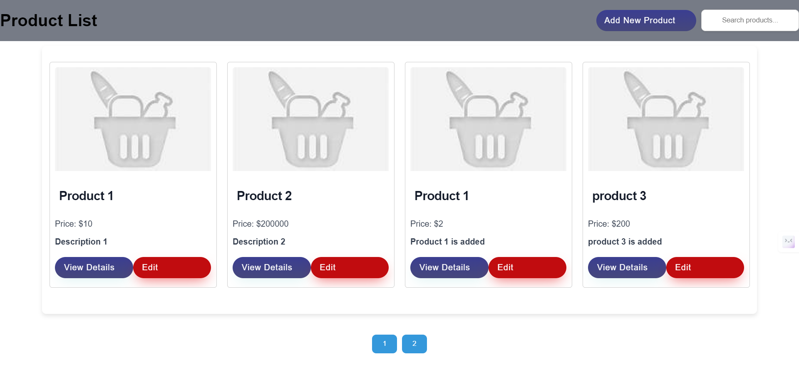
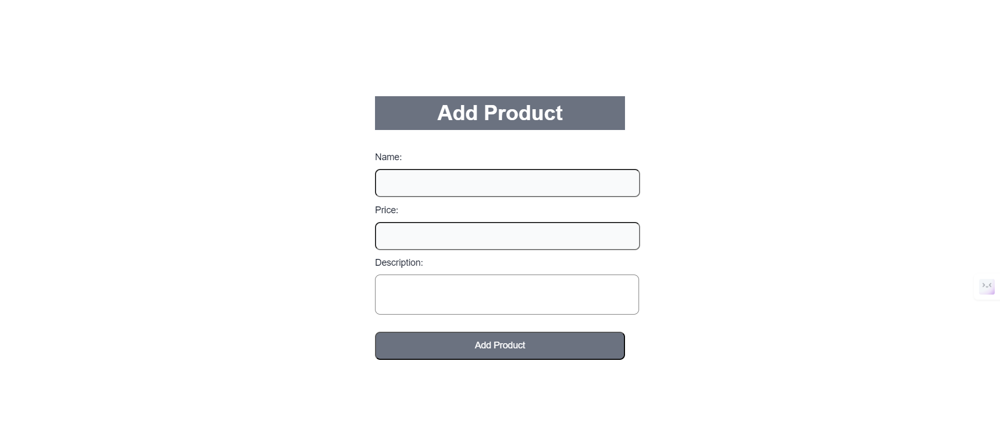
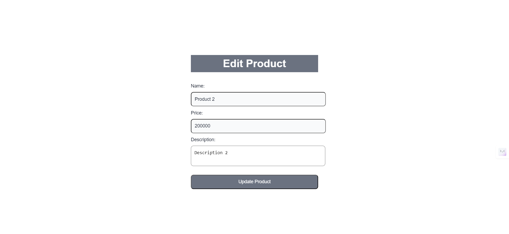
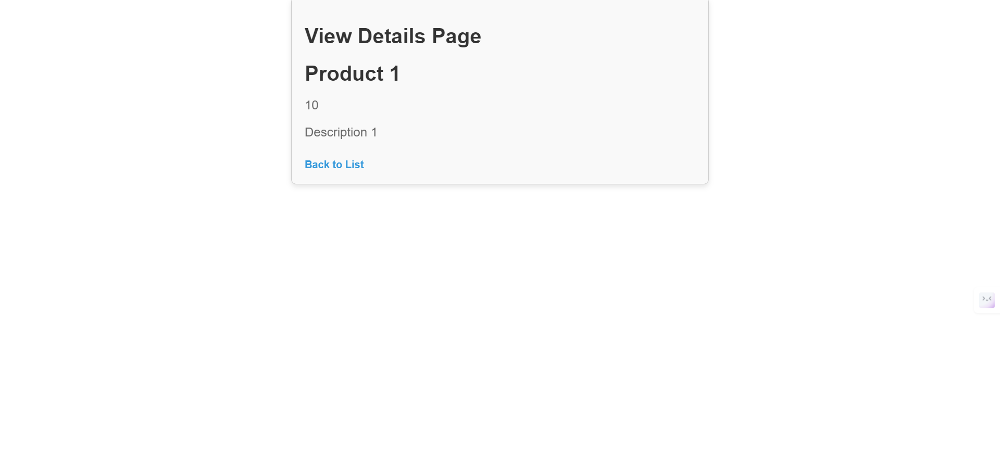
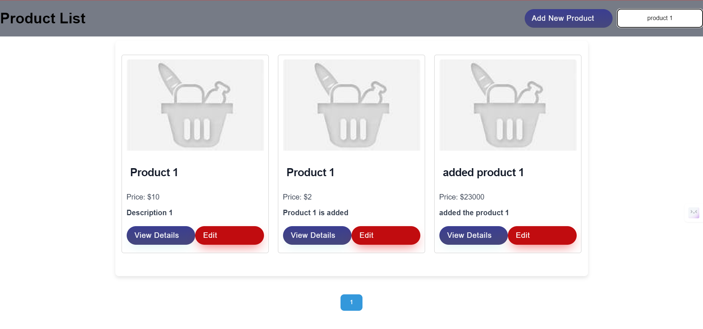

# Product App:

## Introduction
Create a small web application that displays a list of products and allows users to view details of individual products. The application should use React, Redux, React Router, and Axios for API calls. API data can be mocked using JSON files or a mock server.

## Requirements:
   Data Mocking
    •	use JSON files to serve the product data.
    •	Use Axios for making API calls to fetch the product data.

   Create product
     •	Create new product (Can hold new product in memory if using Json file for read list).

   Product List Page
     •	Display a list of products fetched from the mock API.
     •	Each product should display at least the following information: product name, price, and a brief   description.
     •	Include a "View Details" link for each product that navigates to the product detail page.

   Product Detail Page
     •	When a user clicks on "View Details", navigate to a product detail page.
     •	Display detailed information about the selected product: product name, price, description.

   Edit and Save product
     •	Data should be update using redux store and updated in main page.

   Redux Store
     •	Use Redux to manage the state of the application.
     •	Store the list of products and the details of the selected product in the Redux store.
     •	Use Redux actions and reducers to handle state changes.
   
   API Calls with Axios
     •  Use Axios to fetch data from the mock API.
     •	Handle loading states and errors appropriately.

   Styling
     • 	Apply basic styling to make the application visually appealing.
     •	Use CSS or a CSS-in-JS solution of your choice.

   Bonus Points:
     •	Implement a search functionality to filter products on the product list page.
     •	Add pagination to the product list if there are many products.

    
## Project Type
Frontend

## Deployed App
Frontend: [Live Demo](https://product-app-swart.vercel.app/)

## Features
**CSS Implementation:** Not using any library

**Responsive Layout:** The layout is optimized for both mobile and desktop views, ensuring a seamless user experience across devices.

**Feature Implementation:** 

1. Product App:
   - The application features a responsive and visually appealing Navbar with add a product. The product list is displayed on the home page and Search. 
   - When the user clicks on "Add Product", a form is displayed to fill in the product details (name, price, description). After submitting the form, the product is successfully in JSON-server added and the user is redirected back to the home page. The updated product list is displayed.
   - If the user wants to edit a product, they can click on the "Edit" button. The edit form is displayed, allowing the user to modify the product details. After submitting the form, the product is successfully updated. The user is redirected back to the home page, and the updated product list is displayed.
   - If the user wants to view a single product, they can click on the "View Detail" button. The view details are displayed.

2.	Implement a search functionality to filter products on the product list page.
3.	Add pagination to the product list if there are many products.
4.  Deployed the JSON-server using the render.

    
## Design Decisions or Assumptions

**CSS Selection:** Implement the css without using any libraries

## Installation & Getting Started
To run the project locally, follow these steps:

### Clone the repository

    git clone https://github.com/Sravani0410/product-app.git
    

### Install dependencies
 
   Frontend : npm install 

### Start the application

   Frontend:npm start

## Usage

## Technology Stack

**React.js:** React. js, a frontend-focused JS library used mainly for building single-page and multi-page interfaces, is one of the most popular programming technologies worldwide, and the number of companies reaching out to it proves its solid position.

**JSON-Server:** To store the data in json-server to designed for developing modern applications using render to deploy to interact with frontend.

**Deployment:** 
   Frontend :  vercel
   JSON-Server: Render
---
